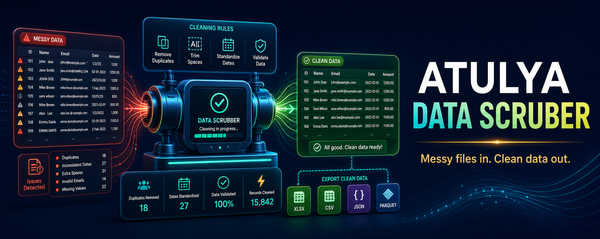

# Atulya DataClean

> **Turn messy business files into clean, usable data in one click.** 🧹📊

Atulya DataClean is planned as one of the first usable Atulya products: a desktop tool for cleaning spreadsheet exports from ERP systems, tax workflows, banks, payroll sources and everyday office files.

> 🚧 This repository is in design and implementation planning. Downloads will appear only after validated builds are ready.

## 📥 Drop In A File, Choose A Result

| Input | One-click preset | Output |
|---|---|---|
| ERP export | Normalize columns, dates and quantities | Analysis-ready workbook |
| Tax purchase/sales sheet | Validate identifiers, amounts and duplicates | Exception report |
| Bank statement | Normalize narration, debit/credit and dates | Reconciliation input |
| Attendance export | Clean employee IDs and shifts | Payroll-ready sheet |
| Vendor/customer master | Deduplicate and validate fields | Corrected master workbook |

## 🧩 Planned Tools

- Remove duplicates, blanks and formatting noise.
- Detect incorrect dates, numeric columns and missing fields.
- Merge a folder of sheets or split a report by branch/vendor.
- Save reusable cleanup recipes with preview and undo-friendly outputs.
- Map columns between systems without editing the source workbook.

## 🏗️ Architecture

## 🖥️ Cross-Platform Plan

| Platform | Planned delivery |
|---|---|
| Windows / macOS / Linux | Drag-and-drop desktop application |
| Server | CLI and Docker worker for scheduled jobs |
| Atulya One | Embedded cleaning engine reused by every module |

## 🗺️ Roadmap

| Phase | Delivery |
|---|---|
| 1 | Excel/CSV import, profiling, duplicate removal and export |
| 2 | Bank, ERP and tax-sheet presets with exception reports |
| 3 | Recipe builder, batch folders and PDF-table inputs |
| 4 | Reconciliation primitives shared with GST and ERP |
| 5 | Scheduled workflows and Atulya One integration |

## 🔐 Data Rule

Input files should never be overwritten by default. Every run produces a new cleaned file and a readable transformation report.

## 🔗 Ecosystem

[Atulya GST](https://github.com/atulyaai/Atulya-GST-Suite) · [Atulya SAP](https://github.com/atulyaai/Atulya-SAP-Automations) · [Atulya Office](https://github.com/atulyaai/Atulya-Office) · [Atulya ERP](https://github.com/atulyaai/Atulya-Accounting-ERP)

## 📜 License

MIT planned for the open-source core.
